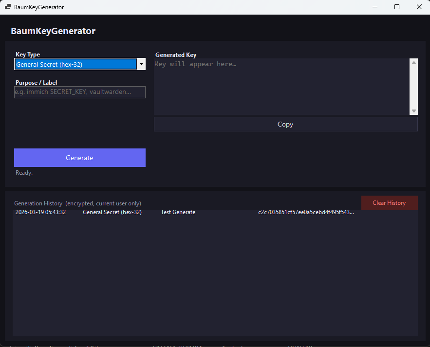

# BaumKeyGenerator

A Windows 11 local utility for quickly generating the secret keys and tokens needed for Docker homelab deployments — including Vaultwarden Argon2 admin tokens.

No internet connection required. Keys are generated entirely on-device using cryptographically secure randomness.



---

## Key Types

| Type | Output | Common Use |
|------|--------|------------|
| **General Secret (hex-32)** | 64-char hex | `SECRET_KEY`, `APP_SECRET`, `ENCRYPTION_KEY` — equivalent to `openssl rand -hex 32` |
| **General Secret (base64)** | URL-safe base64, no padding | Keys that require base64 encoding |
| **JWT Secret (hex-48)** | 96-char hex | HS256/HS512 JWT signing secrets |
| **Database Password** | 24-char mixed | MySQL, PostgreSQL, MariaDB passwords |
| **Alphanumeric Key** | 40-char A-Z/a-z/0-9 | API keys, app tokens |
| **Vaultwarden Admin Token** | Argon2id PHC string | Vaultwarden `ADMIN_TOKEN` — hashed with `m=65540, t=3, p=4` (matches `--preset owasp`) |

For **Vaultwarden**, the app generates a random password, hashes it with Argon2id, and shows both:
- The **PHC string** → paste into `ADMIN_TOKEN` in your `.env`
- The **plain password** → use this to log in to the `/admin` panel

---

## Features

- **Purpose / Label field** — required before generating, so your history always has context
- **History log** — shows every key generated with date, type, and purpose
- **Encrypted history** — stored in `%APPDATA%\BaumKeyGenerator\history.dat` using Windows DPAPI (current user only — other Windows users cannot read it)
- **One-click Copy** — for both the key and the Vaultwarden plain password
- **Double-click history row** — copies the full value to clipboard

---

## Installation

Download from the [latest release](https://github.com/Bruiserbaum/BaumKeyGenerator/releases/latest):

| File | Description |
|------|-------------|
| `BaumKeyGenerator-x.x.x-Setup.exe` | Recommended — installs to Program Files, adds Start Menu entry and optional uninstaller |
| `BaumKeyGenerator-x.x.x-Portable.zip` | No install needed — extract and run |

**Requirements:** Windows 10 21H1 or later (Windows 11 recommended), x64.

---

## Building from Source

```
git clone https://github.com/Bruiserbaum/BaumKeyGenerator.git
cd BaumKeyGenerator/BaumKeyGenerator
dotnet build
```

To publish a self-contained single-file exe:

```
dotnet publish -c Release -r win-x64 --self-contained true -p:PublishSingleFile=true -o ../publish
```

To rebuild the installer (requires [Inno Setup 6](https://jrsoftware.org/isinfo.php)):

```
ISCC installer\BaumKeyGenerator.iss
```

**Stack:** .NET 8 · WinForms · [Konscious.Security.Cryptography.Argon2](https://github.com/kmaragon/Konscious.Security.Cryptography)

---

## Part of the BaumLab Ecosystem

| Project | Description |
|---------|-------------|
| [BaumDocker](https://github.com/Bruiserbaum/BaumDocker) | Homelab Docker stack templates |
| [BaumLabBackup](https://github.com/Bruiserbaum/BaumLabBackup) | Self-hosted Docker backup manager |
| [BaumAdminTool](https://github.com/Bruiserbaum/BaumAdminTool) | Windows admin utility |
| [BaumSecure](https://github.com/Bruiserbaum/BaumSecure) | Windows homelab security analyzer |
| [BaumKeyGenerator](https://github.com/Bruiserbaum/BaumKeyGenerator) | Secret key generator (this project) |

---

## License and Project Status

This repository is a personal project shared publicly for learning, reference, portfolio, and experimentation purposes.

Development may include AI-assisted ideation, drafting, refactoring, or code generation. All code and content published here were reviewed, selected, and curated before release.

This project is licensed under the Apache License 2.0. See the LICENSE file for details.

Unless explicitly stated otherwise, this repository is provided as-is, without warranty, support obligation, or guarantee of suitability for production use.

Any third-party libraries, assets, icons, fonts, models, or dependencies used by this project remain subject to their own licenses and terms.
